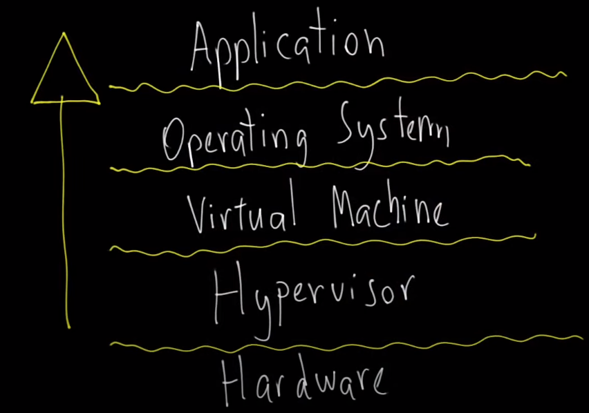
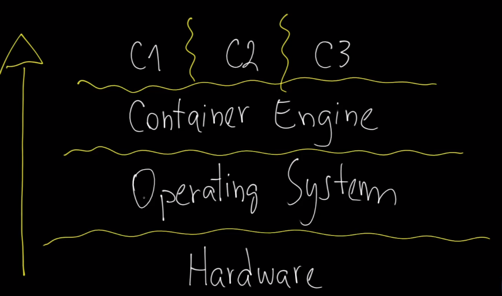
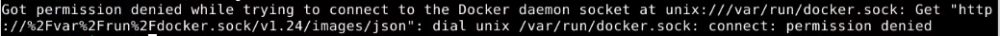
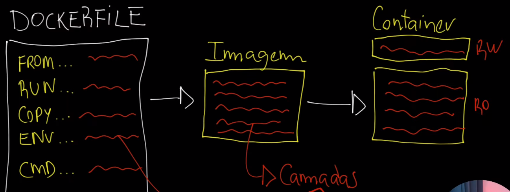

# Docker

&emsp;This is a self-made resume for studying Docker, here your gonna find many theoretical information and a lot of hand's pratice also. Feel free to use or/and make pull-requests!</br>

&emsp;Special thanks to [Mateus Muller](https://mateusmuller.me/), who inspired me to build this resume, the video where part of this content came from is [here](https://www.youtube.com/watch?v=RE31GWJGkwA&ab_channel=MateusMuller).</br>
&emsp;At [references](#references-and-other-content) there is many others contents i judged important while studying about docker and all the peripheral knowledge.</br>

## Authors

- [Orlando Mota Pires](https://github.com/orlandomotapires)

---

## Summary

[Before Container](#before-container)</br>
[Container Idea](#container-idea)</br>
[Docker Architecture](#docker-architecture)</br>
[Installing Docker](#installing-docker)</br>
[Creating a Docker image](#creating-a-docker-image)</br>
[Docker Image Creation Hand's On](#docker-image-creation-hands-on)</br>

---

## **Before Container**



&emsp;While container was not used, in his place was used hypervisors. Hypervisors are still used nowadays, but they make necessary many others components to make it work. The main components this way needs are: Hardware, HyperVisor, VirtualMachine, OperatingSystem and finally the application. You can see that with the hypervisor, a simple task like launch a app becomes a hard work.</br>
&emsp;At last, using a hypervisor, three bad things comes together, hardware farewell, this happens because a need a whole OS to run the app, so i need a dedicated hardware of this OS, second thing is libs hard management, this happens because some libs can be deprecated and the app can use different libs than the OS uses, last thing is the fact of not being mutable, it means that each environment can be different.</br>

## **Container Idea**



&emsp;With containers the scenery changes a lot, first of all you don't need a lot of under layers to build the app, just the Hardware, OS, Container Engine and and the containers themselves. Other thing that changes the game a lot is the fact all the containers will be built using the same Container Engine, and the CE will use the same hardware to build them, so the hardware farewell is not gonna happen anymore, one point to containers.
</br>
&emsp;As the hypervisor had disadvantages, the containers has advantages. First and already sad, resources optimization, second one is application packaging, this resolves the problem of different libs and versions of the same program. The third one is immutability, this quality comes with the second advantage. At last we have ease of deployment, i think this is the main purpose when using containers, it comes with all others over.</br>

## **Installing Docker**

&emsp;The docker installation is very simple, just copy and past commands. The official guide is at this link below.</br>

- [Official Docker Installation Guide](https://docs.docker.com/engine/install/)

&emsp;After installing it you maybe face a common problem, the permission. When you try to use the docker Client (use the ```docker``` command at the command line) you might receive a error message saying you don't have permission to use that command. This happens because your user is not able to access the docker group by default, this group is created when you install the docker on your computer, so you have to add your user to the group manually.</br>



&emsp;To solve solve this problem it is very simple, just follow some steps at the official documentation bellow, those are some post-installation steps.</br>

- [Docker Post-Installation Guide](https://docs.docker.com/engine/install/linux-postinstall/)

## **Docker Architecture**


&emsp;We can divide the docker into three main parts, Client, DockerHost and, registry.</br>

- Client</br>
&emsp;The command line it self that you use for interact with the docker, when you write like ```docker images``` at the command line, you are using the docker Client.</br>

- Docker Host</br>
&emsp;This guy is also called by Docker Daemon and its basically the a service at the machine were the docker is running. You can use the Client to interact directly with the Docker Daemon is self. Something important about the Host is that you don't need to have him at your machine to use the Client, the Host can be in a server machine and you can interact with this Host using your local machine just using the Client.</br>

- Registry</br>
&emsp;You can think the registry just like a place were the images docker can use are saved and you can download and use on your machine. There are many registry's some more used and reliable than others, the most famous is the DockerHub.</br>

## **Creating a Docker image**



&emsp;First off all we need to understand the concept of the DockerFile, a DockerFile is just a common text file where you write all the instructions of how you want your image to be created and delivery it to Docker to him create your image.</br>
&emsp;There are some main parameters we need to understand to build our first DockerFile, there is many others parameters possibles in a dockerfile, they are at this [link](https://docs.docker.com/engine/reference/builder).</br>

- FROM</br>
&emsp;This parameter is where you insert your start point, the base image it is gonna be used to create the new image.</br>

- RUN</br>
&emsp;The commands are gonna run inside this image, if you need to install a package, give some permission to user's, move some file.</br>

- COPY</br>
&emsp;Copy files inside the image, this files can come from your local machine, a server, or a host machine.</br>

- ENV</br>
&emsp;To declare environment variables.</br>

- CMD</br>
&emsp;Witch command will be executed you use the ```docker run``` </br>

&emsp;Now let's talk about the image creation it self. When you run the dockerfile, each one of all those parameters you set at the text file is gonna be created as a layer at the image. Every layer created after another one is gonna be pushed on top of the image, like a stack.</br>
&emsp;But why this stack system exists? This is very useful to create the container, the ultimate goal when using Docker. When you ask your image to create the container it is just necessary to create one more layer on all others pre-existent.</br>
&emsp;Now there is something important to understand, the image is immutable and read-only (RO), the new layer to be created is the container it self and is read-write (RW), this means you can change the content of the container but not image's. It makes really fast and easy the deploy, start, stop, run, delete, all the actions involving the container.</br>

## **Docker Image Creation Hand's On**

&emsp;Now let's create our first image using a application made with [Flask](https://flask.palletsprojects.com/en/2.2.x/quickstart/?highlight=quickstart).</br>

1. Create a file, for example `app.py` and copy the code into, as you can see this code imports the flask lib, but by default the OS does not came with that, so we have to add it manually.</br>
2. We need to set the libs we are going to use to be local, so let's create a environment. First type `python3 -m venv .venv` to create this environment, here we are using the venv module.
3. After that you use the source command `source .venv/bin/activate` to activate the virtual environment and set it to be used, so now everything command we use is gonna be executed in there.
4. Now you can use the pip to install the Flask `pip install flask`
5. For now you can use `flask run` to check if everything is working, it should appear a ip and port for you to connect to your application at the browser with a Hello, World message.
6. Now let's create the dockerfile, there is an example of dockerfile on this repository to facilitate your journey and there is some explanations in there about the parameters. Bellow we have the command used to download the image used as the base image.
   - `docker pull python:3.10-bullseye` </br>
7. Now we have our base image, just need to write the dockerfile following the steps and writing into him all the information he needs to build our new image. Very careful now because the dockerfile need to be written at a correct order, like a procedural language line after line, otherwise the dockerfile wont work correctly.
8. Run a `pip freeze` to help you check all the dependencies your application is gonna need, then run `pip freeze > requirements.txt` to insert those dependencies into a txt file. This file is gonna be really useful to be copied into the container and used to install all the necessary dependencies, facilitating a lot all the process.
9. After builded the all dockerfile, let's create the image. Run the command `docker build -t flask-app:dev-0.0.1`. The `-t` parameter is used to give a name (flask-app) and tag (dev-0.0.1) to our image, feel free to change the name and tag of your own image. Now you can run `docker images` to check if the image has been created correctly, if the process was successful a image called `flask-app` is gonna appear at the docker images.
10. FINALLY let's create our container. With your image created correctly just type `docker run -d -P flask-app:dev-0.0.1` (caution with the name you used to create the image, must be the same here afeter the `-P` parameter) to create the container. The `-d` parameter is used to set the container to run at the background of your machine, not using your current command line. The `-P` parameter says to the container to use the already determined port (5000) as a port to your dockerhost, mapping the port.
11. That is it, now you have your container active. Type `docker ps` to check to active containers than type `localhost:{PORT}` at your browser to access the running container, the PORT must be the number where `49158` is at [this image](./images/PortNumber.png).
12. Now, you can type `docker logs {CONTAINER_ID} -f` to check the log of a container, all access, successful or not, on that port is gonna be registered by this log, the `-f` parameter is to make the command to continuously check for new interactions with that container.
13. Some others commands can be used are: `docker exec {CONTAINER_ID}`, the parameter `exec` is to execute a command inside the container, for example use the `ls` command to list all the folders and files in the container. Or you can enter the container with `docker exec -it {CONTAINER_ID} bash`, the `-it` parameter is to enter the container and the `bash` is to enter as a bash user, being able to run commands.

## **References and other content**

1. <https://www.youtube.com/watch?v=RE31GWJGkwA&ab_channel=MateusMuller>
2. <https://docs.docker.com/get-docker/>
3. <https://docs.docker.com/engine/reference/builder/>
4. <https://docs.docker.com/storage/storagedriver/overlayfs-driver/>
5. <https://man7.org/linux/man-pages/man7/namespaces.7.html>
6. <https://itsfoss.com/linux-daemons/>
7. <https://flask.palletsprojects.com/en/2.2.x/quickstart/?highlight=quickstart>
